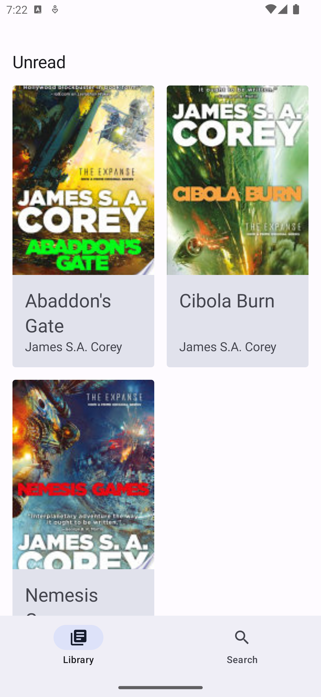
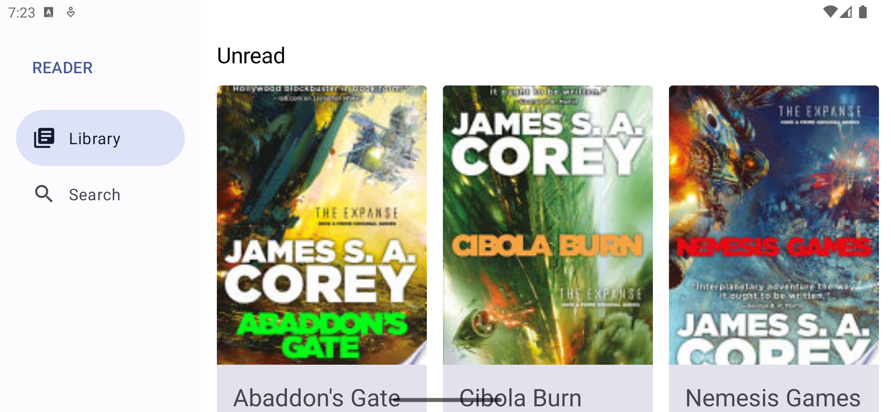

# Reader

Just another one of Adam's sample apps to play around with.

## Adaptive UI

One of the main purposes of this sample project was to explore the latest designs with Material 3, as well as explore adaptive UI based on orientation and device size. A few examples can be seen below. 

    
Phone In Portait

    

    
Phone In Landscape

    

    
Foldable/Small Tablet In Portait

    

